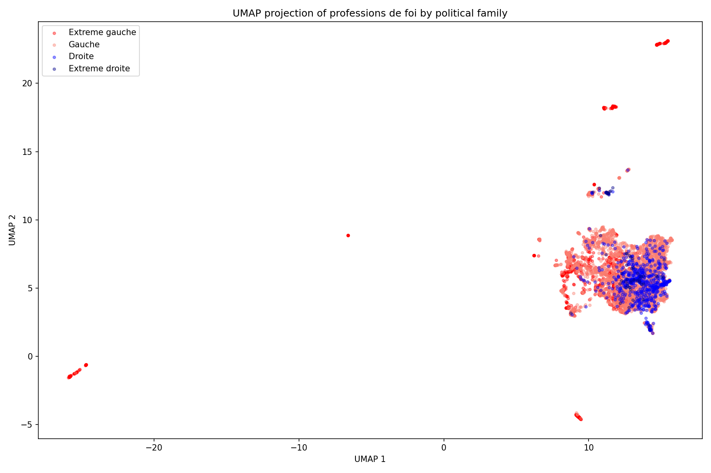

# Political affiliation classification from French legislative campaign manifestos (1973–1993)

> NLP project for ENSAE Paris (2025–2026). We predict a candidate's political family from their *profession de foi* (campaign manifesto) using TF-IDF, a fine-tuned CamemBERT, and a frozen sentence-CamemBERT head, and we map inter-party discourse similarities with t-SNE and UMAP.

<p align="center">
  
</p>

## At a glance

| | |
|---|---|
| **Corpus** | [Archelec](https://archelec.sciencespo.fr) (Sciences Po), OCR'd by [Teklia](https://gitlab.teklia.com/ckermorvant/arkindex_archelec) |
| **Documents** | 4,519 *professions de foi* over 5 elections (1973, 1978, 1981, 1988, 1993) |
| **Classes** | 4 political families: *Extrême gauche*, *Gauche*, *Droite*, *Extrême droite* |
| **Splits** | 70 / 15 / 15 stratified by family, seed 42 |
| **Models** | TF-IDF + LR, CamemBERT fine-tuned, sentence-CamemBERT frozen + LR |
| **Report** | [`report/main.pdf`](report/main.pdf) (NeurIPS 2024 layout) |

## Results

| Model | Test Acc | Macro F1 | CV Acc (5-fold) | Temporal ≤1981 → ≥1988 |
|-------|---------:|---------:|----------------:|-----------------------:|
| TF-IDF + LR (`text_clean`) | 0.841 | 0.795 | 0.835 ± 0.011 | 0.696 |
| TF-IDF + LR (`text_clean_v2`) | **0.842** | 0.794 | **0.850 ± 0.010** | **0.723** |
| CamemBERT fine-tuned (run 2) | 0.710 | 0.650 | – | – |
| sentence-CamemBERT frozen + LR | 0.668 | 0.509 | 0.651 ± 0.010 | 0.422 |

A few takeaways (the full story is in the report). The baseline TF-IDF gets 84% test accuracy, but when you look at its top features they are mostly dates, toponyms and politicians' surnames rather than political vocabulary. A second, more aggressive cleaning pass (`text_clean_v2`) masks those categories; accuracy barely moves, but for Extrême gauche the top features become recognisably political (`travailleurs`, `patrons`, `bourgeoisie`, `révolutionnaires`, `payer`). The Droite and Extrême droite classes still leak a second layer of signal we had not anticipated: local candidates' surnames and minor city names.

A frozen sentence-CamemBERT encoder with a small linear head (~4,100 trainable parameters) reaches only 67% test accuracy vs TF-IDF's 84%. Fine-tuning CamemBERT end-to-end (110M parameters on 3,163 training docs) reaches 71% and overfits after two epochs. On this corpus, sparse lexical features beat contextual embeddings.

Temporal splits drop TF-IDF from 84% to 72% and the frozen head from 67% to 42%, which is probably a more honest number if you wanted to apply the classifier to a new election. Semantic mapping via t-SNE and UMAP on the sentence-CamemBERT embeddings shows heavily overlapping political families (silhouette ≈ −0.02 on the raw 1024-d embeddings), with Extrême gauche being the only reasonably tight cluster.

## Repository layout

```
.
├── src/                       # pipeline scripts (see "Pipeline" below)
├── text_files/                # raw OCR'd corpus (gitignored, obtained from Teklia)
├── data/                      # parquet splits, embeddings, result logs (gitignored)
├── figures/
│   ├── baseline/              # snapshot of the initial tsne / cosine figures
│   ├── error_analysis/        # per-year and per-length accuracy plots
│   └── *.png                  # tsne, cosine, umap, per-party trajectories
├── report/
│   ├── main.tex               # NeurIPS-format write-up
│   ├── main.pdf               # compiled report
│   └── checklist.tex          # NeurIPS checklist
├── requirements.txt
└── README.md
```

## Getting the data

```bash
git clone https://gitlab.teklia.com/ckermorvant/arkindex_archelec.git
python extract_text.py          # unzips the per-year archives into text_files/
```

## Install

```bash
python -m venv .venv && source .venv/bin/activate
pip install -r requirements.txt
```

## Pipeline

```bash
# 1. Build the corpus and a first cleaned text column
python src/data_preparation.py      # parse and aggregate multi-page documents
python src/label_extraction.py      # extract party labels, clean text, split data

# 2. Train the initial two models (TF-IDF baseline on text_clean, CamemBERT fine-tuning)
python src/classification.py

# 3. Build the aggressively-cleaned column text_clean_v2
#    (stopwords, dates, toponyms, politician names)
python src/preprocessing.py

# 4. Re-evaluate TF-IDF with 5-fold CV, bootstrap CIs, and temporal splits
python src/evaluation.py --text_col text_clean    --out data/results_tfidf_v1.txt
python src/evaluation.py --text_col text_clean_v2 --out data/results_tfidf_v2.txt

# 5. Data-efficient alternative: frozen sentence-CamemBERT + LogReg
python src/political_mapping.py                   # produces document_embeddings.npy (one-time)
python src/frozen_classifier.py

# 6. Semantic mapping: UMAP, silhouette/Davies–Bouldin, per-party trajectories
python src/semantic_mapping_v2.py

# 7. Error analysis across both classifiers
python src/error_analysis.py
```

## Compiling the report

The LaTeX `graphicspath` points at `../figures/`, so the project-level `figures/` folder is the single source of truth for images.

```bash
cd report && pdflatex main.tex && pdflatex main.tex
```

## Authors and credits

Maël Trémouille, ENSAE 3A, NLP course 2025–2026. Corpus by the Archelec project at Sciences Po (CEVIPOF), OCR by Teklia.
